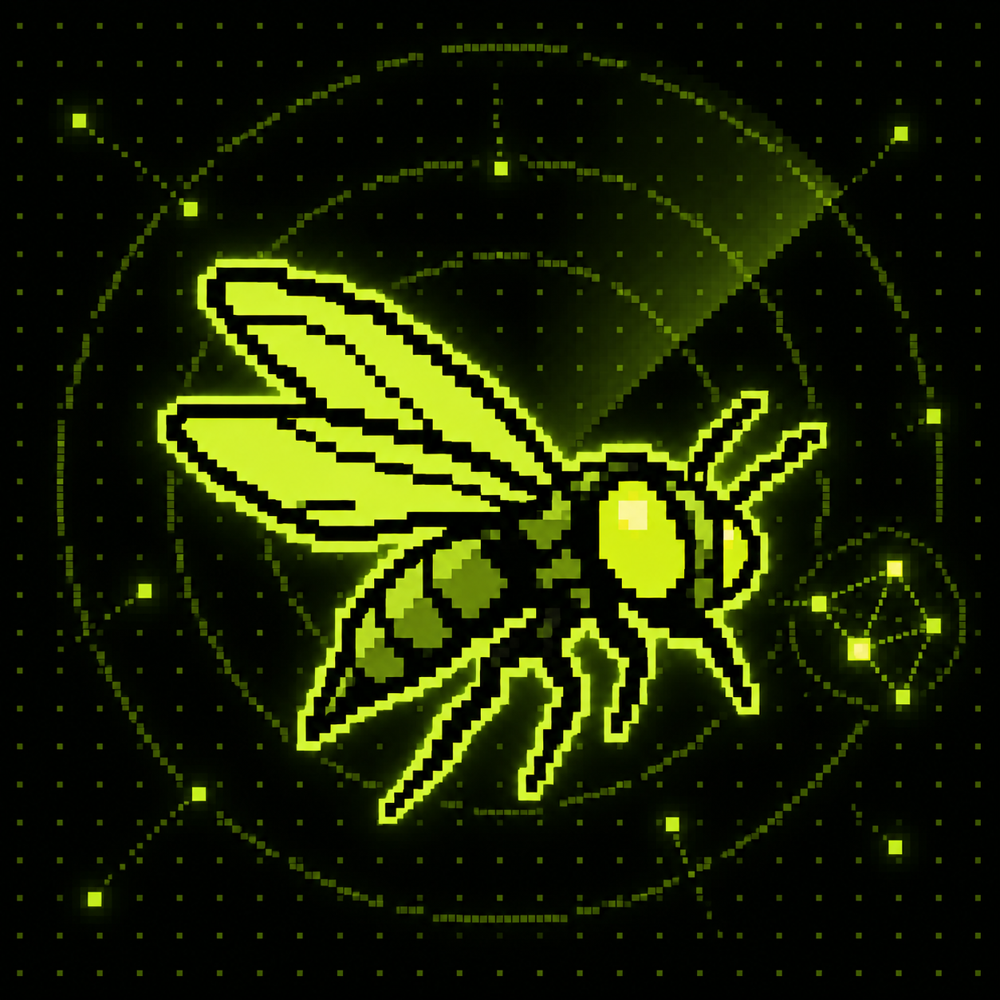
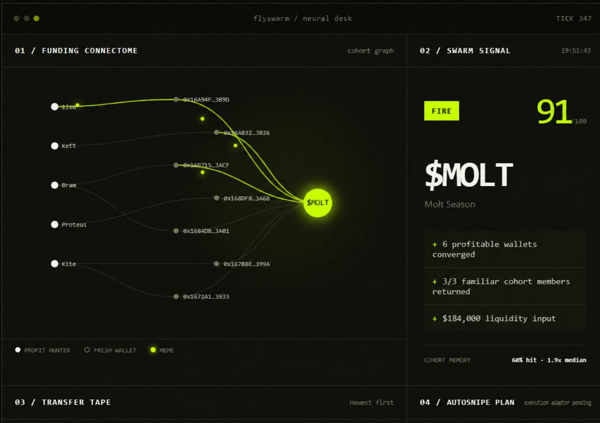

  

  

<h1 align="center">FlySwarm</h1>

  <strong>Wallet-cohort intelligence for Robinhood Chain.</strong> 
  Profitable wallets → fresh addresses → familiar groups → swarm signal → autosnipe plan.

  
  
  
  
  

  <a href="#install">Install</a> ·
  <a href="#token-radar">Token Radar</a> ·
  <a href="#swarm-trace">Swarm Trace</a> ·
  <a href="#signal-desk">Signal Desk</a> ·
  <a href="#how-it-works">How it works</a>

---

## About

FlySwarm is a local-first intelligence desk built around Robinhood Chain token flow.

It discovers current tokens, searches by ticker or contract, maps top holders, follows profitable-wallet funding into fresh addresses, and detects when a familiar wallet group begins converging on the same meme.

Every signal keeps its receipts: the source wallets, funding routes, fresh addresses, returning cohort members, earlier joint entries and the rule that produced the final **FIRE / WATCH / NOISE** decision.

The radar is the product. The terminal feed and JSON endpoints expose the same engine for operators who want to build on top of it.

### Current build

| Engine | Status | What is already in the repository |
|---|---:|---|
| Token discovery | **LIVE** | current Robinhood Chain pairs + newest Pons V2 launches |
| Ticker / contract search | **LIVE** | symbol lookup and exact ERC-20 resolution |
| Holder intelligence | **WORKING** | bubble map, concentration and wallet activity class |
| Swarm Trace | **WORKING** | source → fresh address → token funding reconstruction |
| Cohort memory | **WORKING** | recurring group detection and prior-entry context |
| Signal desk | **WORKING** | explainable score with FIRE / WATCH / NOISE |
| Autosnipe plan | **ALPHA** | threshold, size and execution-adapter boundary |
| Terminal UI | **WORKING** | continuous graph, transfer tape, signal and position desk |

## FlySwarm neural desk

  

> <code>npm start</code> opens the local radar. <code>npm run cli</code> runs the terminal feed. <code>npm test</code> checks the cohort engine.

---

## What FlySwarm does

| Problem | What FlySwarm does | Surface |
|---|---|---|
| new Robinhood tokens keep appearing | refreshes the token universe and keeps a current fallback feed | Token Radar |
| “a wallet transferred funds” is not enough | reconstructs the route and separates source, relay and destination | Swarm Trace |
| top holders hide behind raw addresses | turns balances and activity into an explorable bubble map | Bubble Map |
| one wallet can be noise | waits for several profitable wallets to converge | Cohort Engine |
| the same group may return under new addresses | compares the current formation with remembered cohorts | Formation Memory |
| a score without evidence is useless | prints the exact observations behind every decision | Signal Desk |
| execution needs a clean boundary | prepares threshold and position intent for a later adapter | Autosnipe Plan |

## Install

Node.js 20 or newer. The runtime has zero external packages.

~~~bash
git clone <your-flyswarm-repository>
cd FlySwarm
npm start
~~~

Open:

~~~text
http://127.0.0.1:4173
~~~

Or run the terminal desk:

~~~bash
npm run cli
~~~

## Sixty seconds

~~~bash
npm start       # browser radar + API
npm run cli     # scrolling terminal signal feed
npm test        # deterministic engine check
npm run build   # Cloudflare Worker output
~~~

## Token Radar

The first screen keeps token selection and inspection together:

- recent Pons V2 launches;
- current Robinhood Chain pairs;
- search by <code>$TICKER</code>;
- lookup by exact <code>0x</code> contract;
- price, liquidity and 24-hour volume where available;
- Blockscout contract links;
- holder concentration and activity filters.

If the public Robinhood RPC pauses, FlySwarm keeps the selector alive with current Robinhood Chain pairs from DexScreener.

## Swarm Trace

Select a token and open **SWARM TRACE**.

Each route is presented as:

~~~text
profit hunter → fresh address → target token
       │               │              │
  prior record     relay age      current cohort
~~~

Click a cohort member to open its wallet dossier. The desk shows win rate, realized history, latest funding route and the group’s previous joint entries.

## Signal Desk

The signal is a compact decision, not a black box:

| Input | Weight | Question |
|---|---:|---|
| cohort overlap | 44% | how much of a known group returned? |
| timing proximity | 28% | did the wallets arrive together? |
| liquidity | 18% | can the planned size fit the market? |
| cohort size | up to 10% | is this a group or isolated noise? |

~~~text
score < 70       → NOISE
score 70–83      → WATCH
score ≥ 84       → FIRE
~~~

## How it works

~~~mermaid
flowchart LR
    RH[Robinhood Chain] --> U[Token universe]
    DEX[DEX market feed] --> U
    U --> H[Holder map]
    H --> W[Wallet activity]
    W --> F[Fresh-address routes]
    F --> C[Cohort memory]
    C --> S{Swarm score}
    S -->|low| N[NOISE]
    S -->|forming| WA[WATCH]
    S -->|matched| FI[FIRE]
    FI --> A[Autosnipe plan]
~~~

The hosted build runs as one Cloudflare Worker. The same modules power the local server, terminal feed and browser radar.

## Project map

~~~text
assets/                         README and brand visuals
bin/flyswarm.mjs                terminal entrypoint
docs/METHODOLOGY.md             data model and connectome notes
public/index.html               radar workspace
public/app.js                   token, holder and cohort interactions
public/styles.css               black / acid-lime interface
src/engine.mjs                  transfers, cohort memory and scoring
src/robinhood-live.mjs          RPC, Pons V2 and DEX readers
server.mjs                      local API and event stream
worker.mjs                      hosted Worker entrypoint
~~~

## Data boundary

Token discovery, contracts, market fields and successful RPC reads come from public Robinhood Chain and DexScreener sources. Cohort profitability, historical formations, inferred attribution and signal outcomes are **prototype data** until the production wallet indexer replaces them.

Signing material stays outside the browser and outside this repository. There is no private-key input or transaction broadcaster in the current build.

## License

MIT. See [LICENSE](LICENSE).
